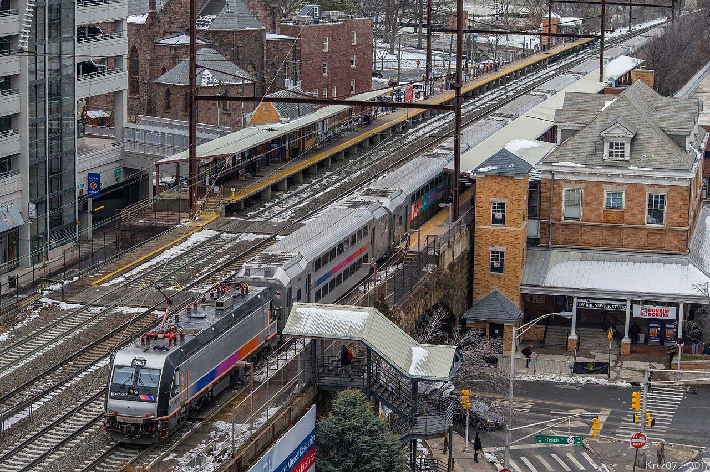
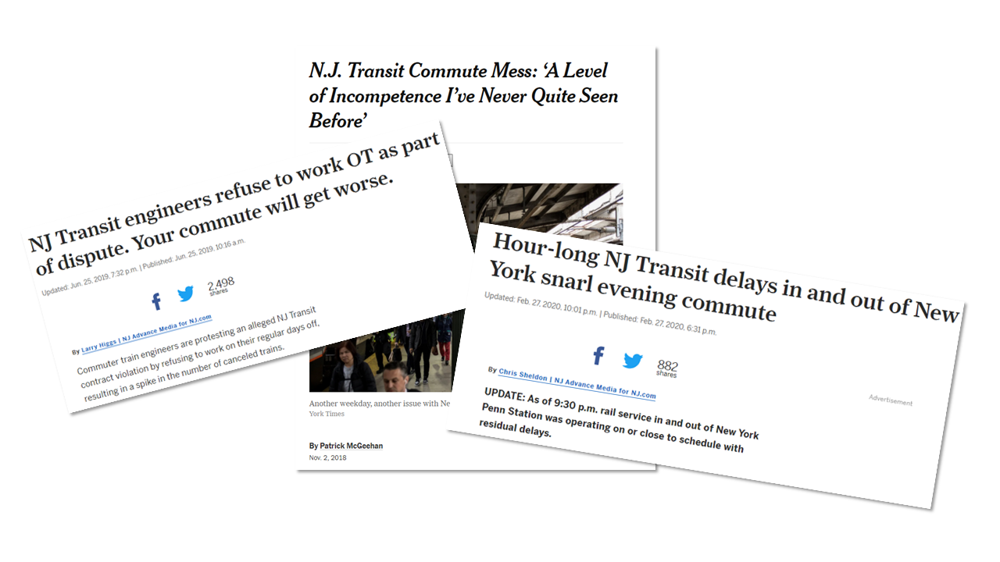

  <style>
  html {
    scroll-behavior: smooth;
  }
d-article {
  contain: none;
}
#TOC {
position: fixed;
top: 10px;
left: 10px;
padding: 10px;
text-align: right;
inline-size: 250px;
overflow-wrap: break-word;
}

@media screen and (max-width: 900px) {
  #TOC {
  position: relative;
}
}
</style>

## Background




The lifeblood of any large metropolitan city is in its transit, but it's a dual-edged sword: not properly anticipating and handling train delays could be disastrous for the region economically and socially. For New Jersey, the densest state in the United States, having a statewide regional rail network is a particularly difficult affair. Developed over 190 years through multiple private railroad companies, the New Jersey Transit network today is still quite vulnerable to delays and outright cancellations, causing widespread frustration and disinterest among the public for transit. Especially as the pandemic has suggested the long-term viability of remote/hybrid work, people more than ever have the option to skip riding the train against their will, and transit agencies must must take the initiative through opportunities like the Building Back Better infrastructure bill to get the ridership they cannot now take for granted.



At the same time, there has been a movement among more transit agencies to expose more of their collected data to the public, whether pre-existing or newly captured. Analysts from inside and outside the agency can develop new rider metrics and analytics based on this historical performance, and eventually develop visualizations and dashboards both for their own purposes and as tools for savvy commuters.

In this report, our firm Limited Express was retained by NJ Transit to develop a proof-of-concept model, called NJT onTrack, that serves this dual purpose for the Rail Operations division. The eventual aim is to develop both a feature metric integrated in the existing NJ Transit app to predict and display potential delays before they occur, and build an analytical dashboard that displays historical train performance, service levels, and delay indicators. Using a linear regression model with temporal-spatial lag predictors, it is hoped that as delay predictions improve, they can eventually feed back into schedule planning and capital infrastructure investment to reduce delay hotspots altogether, both in time (time of day, day of week) and in space (particular bottlenecks or slow zones).

## Setup

```{r knitr_opts, include = FALSE}
knitr::opts_chunk$set(fig.path = 'figs/',
                      echo = TRUE, warning = FALSE, message = FALSE, cache.lazy = FALSE)
```

```{r, message=FALSE, echo=FALSE}
library(caret)
library(data.table)
library(gganimate)
library(ggcorrplot)
library(gridExtra)
library(hms)
library(leaflet)
library(lubridate)
library(patchwork)
library(riem)
library(scales)
library(sf)
library(lwgeom)
library(tidyverse)
library(tidytransit)

source("https://raw.githubusercontent.com/urbanSpatial/Public-Policy-Analytics-Landing/master/functions.r")
`%ni%` <- Negate(`%in%`)
```

```{r define time periods, warning=FALSE}
int.ampeak <- interval(as_hms("06:00:00"),as_hms("10:00:00"))
int.midday <- interval(as_hms("10:00:01"),as_hms("16:00:00"))
int.pmpeak <- interval(as_hms("16:00:01"),as_hms("19:00:00"))
int.evening <- interval(as_hms("19:00:01"),as_hms("23:59:59"))
int.overngt <- interval(as_hms("00:00:00"),as_hms("05:59:59"))
```

## Kaggle data wrangling

Here we load and clean the initial delay data. Uploaded to Kaggle in 2020, it is a snapshot of the real-time departure times of nearly every NJ Transit train at each station from March 2018 to May 2020, compared to their scheduled departure time. 

```{r intake delay data, echo=FALSE, message=FALSE}
invalid <- rbind(read_csv("delay/invalid_trains.csv"),read_csv("delay/invalid_trains_05-01-19_05-18-20.csv"))
invalid$date <- invalid$date %>% str_replace_all("_","-") %>% as.Date()

delay_files <- list.files("delay",pattern="^2019")
delay <- lapply(paste0('delay/',delay_files),read_csv) %>% 
  map(anti_join,invalid,by=c("date","train_id"))

names(delay) <- stringr::str_replace(delay_files, pattern = ".csv", replacement = "")
```

We also load the GTFS data for verifying purposes, and to get geographic stop time data

```{r intake GTFS data}
njt <- read_gtfs("gtfs_njt.zip")
njt_sf <- gtfs_as_sf(njt)
```

Here we begin to wrangle the delay data into a single dataset. A number of tasks are done:
- Agency was filtered for NJ transit, and all imcomplete stops removed, including trains noted as invalid
- Each stop time associated with a time period through the day, from AM peak to overnight
- A dummy variable for noting if the stop time was on the weekday or weekend
- Assessing the route direction of the train associated the stop time; eastbound is towards New York Penn, Hoboken, or Atlantic City, and westbound the opposite direction
- Defining the absolute ordinal stop sequence of each route so numbers are consistent even when express trains skip stations
- A dummy variable for assessing if the train is over 6 minutes late at the stop time

```{r 2019 NEC line delay data}
njtlines <- rbindlist(delay %>% tidyselect:::select(starts_with('2019'))) %>% 
  filter(type == 'NJ Transit') %>% 
  arrange(date,line,train_id,stop_sequence) %>% 
  filter(complete.cases(.)) %>%
  mutate(period = case_when(
    ymd_hms(paste0('1970-01-01',str_sub(scheduled_time,12))) %within% int.ampeak  ~ "AM peak",
    ymd_hms(paste0('1970-01-01',str_sub(scheduled_time,12))) %within% int.midday  ~ "Midday",
    ymd_hms(paste0('1970-01-01',str_sub(scheduled_time,12))) %within% int.pmpeak  ~ "PM peak",
    ymd_hms(paste0('1970-01-01',str_sub(scheduled_time,12))) %within% int.evening  ~ "Evening",
    ymd_hms(paste0('1970-01-01',str_sub(scheduled_time,12))) %within% int.overngt  ~ "Overnight"
  )) %>% mutate(isWkdy = ifelse(wday(date) %in% c(2,3,4,5,6),TRUE,FALSE)
   ) %>% mutate(direction = case_when(
    stop_sequence == 1 & from %ni% c('New York Penn Station','Hoboken','Atlantic City Rail Terminal') ~ 'eastbound',
    stop_sequence == 1 & from %in% c('New York Penn Station','Hoboken','Atlantic City Rail Terminal') ~ 'westbound'
  )) %>% fill(direction) %>% 
  mutate(stop_seq_abs = as.numeric(factor(stop_sequence))) %>% 
  mutate(isLate = if_else(delay_minutes >= 6,1,0))
```

We must also filter out faulty train runs that did not appear to record or change their timepoint when going from first to last station.

```{r filter for more runs that did not capture time change}
first <- njtlines %>% group_by(date,train_id) %>% arrange(stop_sequence) %>% filter(row_number()==1) %>% rename('first_time' = 'actual_time') %>% select(date,train_id,first_time)

last <- njtlines %>% group_by(date,train_id) %>% arrange(-stop_sequence) %>% filter(row_number()==1) %>% rename('last_time' = 'actual_time') %>% select(date,train_id,last_time)

invalid2 <- first %>% left_join(last,by=c('date','train_id')) %>% filter(first_time == last_time)

njtlines <- njtlines %>% anti_join(invalid2,by=c('date','train_id')) %>% filter(delay_minutes <= 240)
```


## Exploratory analysis and visualization

We begin by displaying a simple histogram of the percentage of trains that are categorized as late each week, by line. Most lines show close to a normal distribution, with the Atlantic City Line notably skewed towards being more consistently late. The Princeton Shuttle (or Dinky) is only two stops, and thus is not expected to be noticably late.

```{r}
njtlines %>% group_by(line,week(date)) %>%
  summarise(pctLate = sum(isLate==1)/sum(isLate %in% c(0,1))) %>% 
  ggplot(aes(pctLate)) + geom_histogram() + facet_wrap(vars(line))
```

### Schedule deviance chart, faceted by time/direction of service

Here we separated the trains based on the period of the day, and draw diagrams show the average delay through the entire journey of that period. Some signifiant time-space outliers in delays begin to appear, such as the Raritan Valley Line on westbound weekend overnights, which indicate that there is some underlying static pattern, such as maintenance or tight scheduling, that is causing consistent delays.

```{r schedule deviance summarise by time period, fig.width=10, fig.height=6}
  p1 <- njtlines %>% filter(isWkdy & line != "Atl. City Line") %>% group_by(line,direction,period,stop_seq_abs) %>%
    summarise(avgdelay = mean(delay_minutes)) %>% 
    ggplot(aes(x=stop_seq_abs, y=avgdelay, color=line)) +
    geom_line() +
    facet_grid(direction ~ factor(period,levels=c("AM peak","Midday","PM peak","Evening","Overnight"))) +
    ggtitle('Weekday') + theme(legend.position='none')
  p2 <- njtlines %>% filter(!isWkdy & line != "Atl. City Line") %>% group_by(line,direction,period,stop_seq_abs) %>%
    summarise(avgdelay = mean(delay_minutes)) %>% 
    ggplot(aes(x=stop_seq_abs, y=avgdelay, color=line)) +
    geom_line() +
    facet_grid(direction ~ factor(period,levels=c("AM peak","Midday","PM peak","Evening","Overnight"))) +
    ggtitle('Weekend') + theme(legend.position='bottom')
  
  p1 / p2
```

Compared to the other lines, we can see that the Atlantic City line has considerably higher baseline levels of delays. This is because in 2019, much of the ACRL was on maintenance due to ongoing positive train control signalling installation; the data snapshot here may not be indicative of future trends.

```{r schedule deviance ACRL, fig.width=10, fig.height=6}
  p1 <- njtlines %>% filter(isWkdy & line == "Atl. City Line") %>% group_by(direction,period,stop_seq_abs) %>%
    summarise(avgdelay = mean(delay_minutes)) %>% 
    ggplot(aes(x=stop_seq_abs, y=avgdelay)) +
    geom_line() +
    facet_grid(direction ~ factor(period,levels=c("AM peak","Midday","PM peak","Evening","Overnight"))) +
    ggtitle('Weekday') + theme(legend.position='none')
  p2 <- njtlines %>% filter(!isWkdy & line == "Atl. City Line") %>% group_by(direction,period,stop_seq_abs) %>%
    summarise(avgdelay = mean(delay_minutes)) %>% 
    ggplot(aes(x=stop_seq_abs, y=avgdelay)) +
    geom_line() +
    facet_grid(direction ~ factor(period,levels=c("AM peak","Midday","PM peak","Evening","Overnight"))) +
    ggtitle('Weekend') + theme(legend.position='bottom')
  
  p1 / p2
```

### Line/station shapefiles

We also loaded the station data with geometry.

```{r}
njgin.line <- st_read("https://opendata.arcgis.com/datasets/e6701817be974795aecc7f7a8cc42f79_0.geojson")
njgin.station <- st_read("https://opendata.arcgis.com/datasets/4809dada94c542e0beff00600ee930f6_0.geojson")
```


### Stringline diagram of one day's service

Here we introduce the Stringline diagram. Used by transit agencies throughout the world, it is a visualized tool for rail dispatchers to quickly view train schedule and operation on a certain line. The x-axis is time and y are the stations spaced by their actual distance. In this Northeast Corridor stringline on a random day, we can see that westbound trains are consistently more late than eastbound ones, a predictor that is of particular importance.

To accurately display the stringline we first get the milepost distance of each station, which is the approximate track-mileage distance of each station from a defined terminal like New York Penn Station. The inter-station milepost distance, or station spacing, was also recorded and included as a predictor.

```{r set inter-station distance}
milepost <- read_csv("milepost.csv")
njtlines <- njtlines %>% 
  left_join(milepost %>% rename(to.dist.mp = dist_mp),by=c("to"="station")) %>% 
  left_join(milepost %>% rename(from.dist.mp = dist_mp),by=c("from"="station")) %>% 
  mutate(inter.dist.mp=abs(from.dist.mp-to.dist.mp))
```

```{r stringline diagram, fig.width=6, fig.height=4}
oneday <- njtlines %>% filter(line == "Northeast Corrdr" & date %in% slice_sample(.)) %>%
  mutate(to.dist.mp=to.dist.mp*-1)

oneday %>% 
  ggplot(aes(y=to.dist.mp,group=train_id,color=direction)) +
    geom_line(aes(x=scheduled_time),linetype='dashed',lwd=.50) +
    geom_line(aes(x=actual_time),lwd=.50) +
    scale_y_continuous(breaks = oneday$to.dist.mp, labels = oneday$to, minor_breaks = NULL) +
    scale_x_datetime(date_breaks = "1 hour", labels = date_format("%H:%M")) +
    labs(x='',y='Station (by milepost distance)',
         title="Northeast Corridor Line stringline diagram",
         subtitle=paste("on sample date",oneday$date,"| Dashed is scheduled time, solid is actual time")) +
    theme(legend.position='none') +
    facet_grid(rows=vars(direction))
```

## Feature engineering

### Weather

Weather has impacts on trains running significantly late. However, the weathers that has the most impact on rail operations is not precipitation, but wind speed, as the graph on the right one shows. The stronger wind is, there are more severe delays are observed.

```{r weather}
weather.DataNWK <- 
  riem_measures(station = "EWR", date_start = "2019-01-01", date_end = "2019-12-31")

weather.PanelNWK <-  
  weather.DataNWK %>%
  mutate_if(is.character, list(~replace(as.character(.), is.na(.), "0"))) %>% 
  replace(is.na(.), 0) %>%
  mutate(interval60 = ymd_h(substr(valid, 1, 13))) %>%
  mutate(week = week(interval60),
         dotw = wday(interval60, label=TRUE)) %>%
  group_by(interval60) %>%
  summarize(Temperature = max(tmpf),
            Precipitation = sum(p01i),
            Rel_Humidity = mean(relh),
            Wind_Speed = max(sknt)) %>%
  mutate(Temperature = ifelse(Temperature == 0, 42, Temperature))

grid.arrange(top = "Weather Data - Newark, NJ - March-October 2019",
             ggplot(weather.PanelNWK, aes(interval60,Temperature)) + geom_line() + 
               labs(title="Temperature", x="Hour", y="Temperature"),
             ggplot(weather.PanelNWK, aes(interval60,Precipitation)) + geom_line() + 
               labs(title="Percipitation", x="Hour", y="Percipitation"),
             ggplot(weather.PanelNWK, aes(interval60,Rel_Humidity)) + geom_line() + 
               labs(title="Relative humidity", x="Hour", y="Relative humidity"),
             ggplot(weather.PanelNWK, aes(interval60,Wind_Speed)) + geom_line() + 
               labs(title="Wind Speed", x="Hour", y="Wind Speed"))
```

```{r weather join}
njtlines <- njtlines %>%
  mutate(interval30 = floor_date(scheduled_time, unit = "30min"),
         interval60 = floor_date(scheduled_time, unit = "hour"),
         week = week(scheduled_time),
         dotw = wday(scheduled_time),
         trip_count = 1) %>%
  left_join(weather.PanelNWK, by = "interval60")%>%
  na.omit()
```

### Cancelled trains data

One open data set from NJT is particularly valuable: cancellations by month categorized by reason. This is a direct test of the theory that knock-on disruptions to one train can propagate into other trains close in time. 

The data here also reflects a spontaneous and episodic incident that was previously not considered: a spike of train cancellations in June 2019 is due to [labor disputes](https://www.nj.com/traffic/2019/06/nj-transit-engineers-refuse-to-work-ot-as-part-of-dispute-your-commute-will-get-worse.html), that resulted in a local peak for average train delay. 

```{r cancelled trains}
cancel <- bind_rows(
  read_csv("cancel/RAIL_ACRL_CANCELLATIONS_DATA.csv") %>% mutate(line="Atl. City Line"),
  read_csv("cancel/RAIL_BNTN_CANCELLATIONS_DATA.csv") %>% mutate(line="Bergen Co. Line"),
  read_csv("cancel/RAIL_MNBN_CANCELLATIONS_DATA.csv") %>% mutate(line="Montclair-Boonton"),
  read_csv("cancel/RAIL_MNE_CANCELLATIONS_DATA.csv") %>% mutate(line="Morristown Line"),
  read_csv("cancel/RAIL_NEC_CANCELLATIONS_DATA.csv") %>% mutate(line="Northeast Corrdr"),
  read_csv("cancel/RAIL_NJCL_CANCELLATIONS_DATA.csv") %>% mutate(line="No Jersey Coast"),
  read_csv("cancel/RAIL_PASC_CANCELLATIONS_DATA.csv") %>% mutate(line="Pascack Valley"),
  read_csv("cancel/RAIL_RARV_CANCELLATIONS_DATA.csv") %>% mutate(line="Raritan Valley"),
  ) %>% filter(YEAR %in% c(2018,2019)) %>% mutate(CANCEL_COUNT = as.numeric(CANCEL_COUNT),CANCEL_TOTAL = as.numeric(CANCEL_TOTAL))

delayByMonth <- njtlines %>% 
  group_by(line,year(date),month(date,abbr=T)) %>% summarise(meanDelay = mean(delay_minutes)) %>%
  rename('YEAR'='year(date)','MONTH'='month(date, abbr = T)')

ggplot() +
  geom_bar(data=filter(cancel,line=="Northeast Corrdr"), 
           aes(fill=reorder(CATEGORY,-CANCEL_COUNT),
               x=factor(str_sub(str_to_sentence(filter(cancel,line=="Northeast Corrdr")$MONTH),1,3),level=month.abb),
               y=CANCEL_COUNT),
           position="stack",stat="identity") +
  geom_point(data=filter(delayByMonth,line=="Northeast Corrdr"), aes(x=MONTH,y=meanDelay*10)) +
  scale_fill_discrete(name='Category') +
  scale_y_continuous(sec.axis=sec_axis(trans=~./10,name='Average delay (min)')) +
  labs(title='NJT cancellations by month and reason',
       subtitle=paste("Line: ",filter(cancel,line=="Northeast Corrdr")$line),
       x='Month', y='Count of cancellations') +
  facet_grid(rows=vars(YEAR))

cancel <- cancel %>% select(-CANCEL_PERCENTAGE) %>% 
  pivot_wider(names_from=CATEGORY,values_from=CANCEL_COUNT) %>%
  rename(crewAvail = `Crew/Engineer Availability`,
         equipAvail = `Equipment Availability`,
         humanFactor = `Human Factor`,
         infraEng = `Infrastructure Engineering`)

njtlines <- njtlines %>% mutate(YEAR=as.character(year(date)),MONTH=str_to_upper(month(date, label=T, abbr=F))) %>% 
  left_join(cancel,by=c('line','YEAR','MONTH')) %>% mutate_if(is.numeric,coalesce,0) %>% 
  mutate(MONTH = factor(str_to_sentence(MONTH), level=month.name),
         to_id = as.character(to_id),from_id = as.character(from_id))
```

```{r}
njtlines <- njtlines %>% left_join(dplyr::select(njt_sf$stops,stop_id,zone_id,geometry),by=c("to_id"="stop_id")) %>% st_as_sf()
```

## Regression model training

We introduce the time lag into our predictor set, with several intervals: 30 minutes, 1/1.5/2/3/12 hours, and one day. The correlation coefficients show that all have reasonably good correlation.

```{r time lags}
njtlines <- njtlines %>% 
  arrange(from,interval30) %>% 
  mutate(lag30Min = dplyr::lag(delay_minutes,1),
         lag1Hour = dplyr::lag(delay_minutes,2),
         lag90Min = dplyr::lag(delay_minutes,3),
         lag2Hour = dplyr::lag(delay_minutes,4),
         lag3Hour = dplyr::lag(delay_minutes,6),
         lag12Hour = dplyr::lag(delay_minutes,24),
         lag1Day = dplyr::lag(delay_minutes,48)
  )
```

```{r evaluate_lags, cache = TRUE, warning = FALSE, message = FALSE}
as.data.frame(njtlines) %>%
    group_by(interval30) %>% 
    summarise_at(vars(starts_with("lag"), "delay_minutes"), mean, na.rm = TRUE) %>%
    gather(Variable, Value, -interval30, -delay_minutes) %>%
    mutate(Variable = factor(Variable, levels=c("lag30Min","lag1Hour","lag90Min","lag2Hour",
                                                "lag3Hour","lag12Hour","lag1Day")))%>%
    group_by(Variable) %>%  
    summarize(correlation = round(cor(Value, delay_minutes),2))
```

### Correlation matrix

```{r, fig.width=8,fig.height=8}
njtlines %>% st_drop_geometry() %>% select_if(is.numeric) %>%
  cor() %>% ggcorrplot(type="lower", method="circle") +
  scale_size_continuous(range=c(1,8),)+
  labs(title = "Correlation matrix",
       subtitle = "Across numeric variables")
```


Split our data into training and testing sets.

```{r train_test, cache = TRUE}
njtlines <- njtlines %>% mutate(logDelay = log(delay_minutes + 0.1)) %>%
  filter(line %in% c('Northeast Corrdr','No Jersey Coast'))

delay.Train <- filter(njtlines, date < ymd(20190701))
delay.Test <- filter(njtlines, date >= ymd(20190701))
```

For our model, we select predictors like station segments, period of the day, whether it's weekday, direction, precipitation, cancel information, and time-lag.

```{r}
fit <- lm(logDelay ~ line + to + period + isWkdy + direction + Precipitation +
            CANCEL_TOTAL + AMTRAK + crewAvail + 
            `equipAvail` + Mechanical + inter.dist.mp +
            lag30Min + lag1Hour + lag90Min + lag2Hour + lag3Hour + lag12Hour,
          data=delay.Train)
```

Based on the model, here is the result of our predictions by station:

```{r stargazer, results='asis'}
stargazer::stargazer(fit, type='html', align=TRUE, no.space=TRUE)
```

### Predictions on test data

Our model results are promising, with the best predictive power being the model including the time lags. The mean absolute error for the test set by week is around 1.2 minutes, but cross-validated by hour of week, the distribution peaks at 0.1 minutes. 

```{r nest_data, message=FALSE, warning=FALSE, cache=TRUE}
delay.Test.weekNest <- 
  delay.Test %>%
  nest(-week)
```

```{r predict_function, cache = TRUE}
model_pred <- function(dat, fit){
   pred <- predict(fit, newdata = dat)}
```

```{r make_predictions, cache=FALSE}
week_predictions <- 
  delay.Test.weekNest %>% 
    mutate(model = map(.x = data, fit = fit, .f = model_pred)) %>% 
    gather(Regression, Prediction, -data, -week) %>%
    mutate(Observed = map(data, pull, logDelay),
           Absolute_Error = map2(Observed, Prediction, ~ abs(.x - .y)),
           MAE = map_dbl(Absolute_Error, mean, na.rm = TRUE),
           sd_AE = map_dbl(Absolute_Error, sd, na.rm = TRUE))

```

```{r plot_errors_by_model, cache = TRUE}
week_predictions %>%
  dplyr::select(week, Regression, MAE) %>%
  gather(Variable, MAE, -Regression, -week) %>%
  ggplot(aes(week, MAE)) + 
    geom_bar(aes(fill = Regression), position = "dodge", stat="identity") +
    labs(title = "Mean Absolute Errors by week") + theme(legend.position='none')
```

```{r error_vs_actual_timeseries, cache = TRUE, warning = FALSE, message = FALSE}
week_predictions %>% 
    mutate(interval30 = map(data, pull, interval30),
           from = map(data, pull, from),
           direction = map(data,pull,direction)) %>%
    dplyr::select(interval30, from, direction, Observed, Prediction, Regression) %>%
    unnest(cols = c(interval30, from, direction, Observed, Prediction)) %>%
    gather(Variable, Value, -Regression, -interval30, -from, -direction) %>%
    group_by(Regression, Variable, interval30, direction) %>%
    summarize(Value = mean(Value)) %>%
    ggplot(aes(interval30, exp(Value)-0.1, colour=Variable)) + 
      geom_line(size = 0.5) + 
      facet_wrap(~direction, ncol=1) +
      labs(title = "Predicted/Observed delay time series",
           subtitle = "Test set of three weeks",  x = "Datetime", y= "Delay (minutes)") +
    theme(legend.position='bottom') +
    coord_cartesian(ylim=c(0,15))
```

## Cross-validation

```{r cv1, echo=FALSE}
crossValidate <- function(dataset, id, dependentVariable, indVariables) {
  
  allPredictions <- data.frame()
  cvID_list <- unique(dataset[[id]])
  
  for (i in cvID_list) {
    
    thisFold <- i
    
    fold.train <- filter(dataset, dataset[[id]] != thisFold) %>% as.data.frame() %>% 
      dplyr::select(all_of(id), all_of(indVariables), all_of(dependentVariable))
    fold.test  <- filter(dataset, dataset[[id]] == thisFold) %>% as.data.frame() %>% 
      dplyr::select(all_of(id), all_of(indVariables), all_of(dependentVariable))
    
    regression <-
      glm(paste0(dependentVariable,"~ ."), family = "gaussian",
          data = dplyr::select(fold.train,-id))
    
    thisPrediction <- 
      mutate(fold.test, Prediction = predict(regression, fold.test, type = "response"))
    
    allPredictions <-
      rbind(allPredictions, thisPrediction)
    
  }
  return(allPredictions)
}
```

```{r cv2, echo=FALSE, warning=FALSE, message = FALSE, cache = TRUE}
reg.vars <- word(str_sub(str_replace_all(toString(fit$terms[[3]]),'\\,', ' +'),5),1:21,sep=fixed(" + "))

reg.cv.time <- crossValidate(
  dataset = delay.Test %>% mutate(day.hour = paste(dotw,hour(interval60))),
  id = "day.hour",
  dependentVariable = "logDelay",
  indVariables = reg.vars) %>%
  dplyr::select(day.hour, logDelay, Prediction)

reg.cv.station <- crossValidate(
  dataset = delay.Test,
  id = "to",
  dependentVariable = "logDelay",
  indVariables = reg.vars) %>%
  dplyr::select(to, logDelay, Prediction)
```

```{r, echo=FALSE, warning=FALSE, message = FALSE, cache = TRUE}
reg.cv.time %>%
  group_by(day.hour) %>% 
  summarize(Mean_Error = mean(Prediction - logDelay, na.rm = T),
            MAE = mean(abs(Mean_Error), na.rm = T)) %>%
  ungroup() %>%
  ggplot() + 
    geom_histogram(aes(MAE), bins = 30) +
    geom_vline(xintercept = 0) + 
    labs(title="Cross-validation: mean average error", subtitle = "k-fold cross validation: Day of Week + Hour",
         x="Mean Absolute Error", y="Count")
```

```{r cv3, echo=FALSE, warning=FALSE, message = FALSE, cache = TRUE}
reg.cv.station %>%
  group_by(to) %>% 
  summarize(Mean_Error = mean(Prediction - logDelay, na.rm = T),
            MAE = mean(abs(Mean_Error), na.rm = T)) %>%
  ungroup() %>% left_join(njtlines %>% filter(date %in% slice_sample(.)) %>% distinct(to,to_id),by='to') %>%
  left_join(dplyr::select(njt_sf$stops,stop_id,zone_id,geometry),by=c("to_id"="stop_id")) %>% st_as_sf() %>% 
  ggplot() +
  geom_sf(aes(color=MAE,size=MAE))
```

## Conclusion

More work needs to be done in predicting large delays of 15 minutes and more better.

However, train delays are difficult to predict. It has less external, social factors but more hardcore engineering. We can point out certain factors relatively easily, whether because of bottlenecks on physical trackage; but not being able to to predict Amtrak dispatchers that actually control the traffic, and other incidents like mechanical issues, passenger-related delays. More data about the rolling stocks may help us to understand delays related to mechanical issues. 
