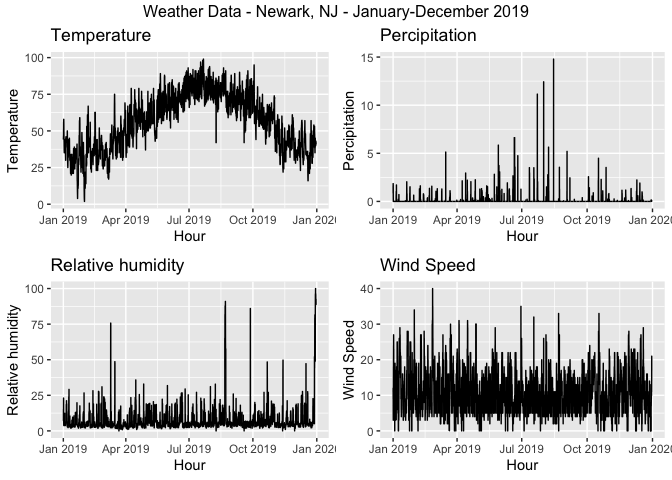
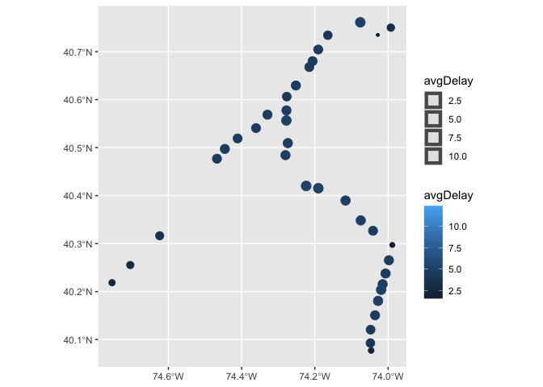
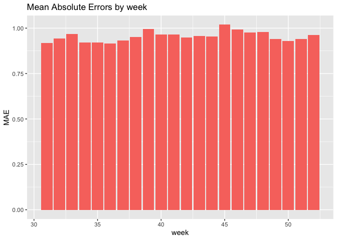
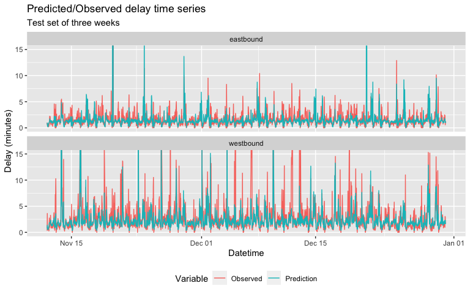

<style>
  html {
    scroll-behavior: smooth;
  }
d-article {
  contain: none;
}
#TOC {
position: fixed;
top: 10px;
left: 10px;
padding: 10px;
text-align: right;
inline-size: 250px;
overflow-wrap: break-word;
}

@media screen and (max-width: 900px) {
  #TOC {
  position: relative;
}
}
</style>

## Background


The lifeblood of any large metropolitan city is in its transit, but it’s
a dual-edged sword: not properly anticipating and handling train delays
could be disastrous for the region economically and socially. For New
Jersey, the densest state in the United States, having a statewide
regional rail network is a particularly difficult affair. Developed over
190 years through multiple private railroad companies, the New Jersey
Transit network today is still quite vulnerable to delays and outright
cancellations, causing widespread frustration and disinterest among the
public for transit. Especially as the pandemic has suggested the
long-term viability of remote/hybrid work, people more than ever have
the option to skip riding the train against their will, and transit
agencies must must take the initiative through opportunities like the
Building Back Better infrastructure bill to get the ridership they
cannot now take for granted.


At the same time, there has been a movement among more transit agencies
to expose more of their collected data to the public, whether
pre-existing or newly captured. Analysts from inside and outside the
agency can develop new rider metrics and analytics based on this
historical performance, and eventually develop visualizations and
dashboards both for their own purposes and as tools for savvy commuters.

In this report, our firm Limited Express was retained by NJ Transit to
develop a proof-of-concept model, called NJT onTrack, that serves this
dual purpose for the Rail Operations division. The eventual aim is to
develop both a feature metric integrated in the existing NJ Transit app
to predict and display potential delays before they occur, and build an
analytical dashboard that displays historical train performance, service
levels, and delay indicators. Using a linear regression model with
temporal-spatial lag predictors, it is hoped that as delay predictions
improve, they can eventually feed back into schedule planning and
capital infrastructure investment to reduce delay hotspots altogether,
both in time (time of day, day of week) and in space (particular
bottlenecks or slow zones).

## Setup

``` r
int.ampeak <- interval(as_hms("06:00:00"),as_hms("10:00:00"))
int.midday <- interval(as_hms("10:00:01"),as_hms("16:00:00"))
int.pmpeak <- interval(as_hms("16:00:01"),as_hms("19:00:00"))
int.evening <- interval(as_hms("19:00:01"),as_hms("23:59:59"))
int.overngt <- interval(as_hms("00:00:00"),as_hms("05:59:59"))
```

## Kaggle data wrangling

Here we load and clean the initial delay data. Uploaded to Kaggle in
2020, it is a snapshot of the real-time departure times of nearly every
NJ Transit train at each station from March 2018 to May 2020, compared
to their scheduled departure time. For analysis purposes, it was decided
to restrict the analysis timeframe to 2019 only, as data from 2018 was
found to be relatively spotty, and 2020’s data factors were of course
marred by the pandemic. In addition, because of continued rendering
issues, the rail lines for analysis were limited to the Northeast
Corridor and North Jersey Coast Line

We also load the GTFS data for verifying purposes, and to get geographic
stop time data

``` r
njt <- read_gtfs("gtfs_njt.zip")
njt_sf <- gtfs_as_sf(njt)
```

Here we begin to wrangle the delay data into a single dataset. A number
of tasks are done: - Agency was filtered for NJ transit, and all
imcomplete stops removed, including trains noted as invalid - Each stop
time associated with a time period through the day, from AM peak to
overnight - A dummy variable for noting if the stop time was on the
weekday or weekend - Assessing the route direction of the train
associated the stop time; eastbound is towards New York Penn, Hoboken,
or Atlantic City, and westbound the opposite direction - Defining the
absolute ordinal stop sequence of each route so numbers are consistent
even when express trains skip stations - A dummy variable for assessing
if the train is over 6 minutes late at the stop time

``` r
njtlines <- rbindlist(delay %>% tidyselect:::select(starts_with('2019'))) %>% 
  filter(type == 'NJ Transit') %>% 
  filter(line %in% c('Northeast Corrdr','No Jersey Coast','Atl. City Line')) %>% 
  arrange(date,line,train_id,stop_sequence) %>% 
  filter(complete.cases(.)) %>%
  mutate(period = case_when(
    ymd_hms(paste0('1970-01-01',str_sub(scheduled_time,12))) %within% int.ampeak  ~ "AM peak",
    ymd_hms(paste0('1970-01-01',str_sub(scheduled_time,12))) %within% int.midday  ~ "Midday",
    ymd_hms(paste0('1970-01-01',str_sub(scheduled_time,12))) %within% int.pmpeak  ~ "PM peak",
    ymd_hms(paste0('1970-01-01',str_sub(scheduled_time,12))) %within% int.evening  ~ "Evening",
    ymd_hms(paste0('1970-01-01',str_sub(scheduled_time,12))) %within% int.overngt  ~ "Overnight"
  )) %>% mutate(isWkdy = ifelse(wday(date) %in% c(2,3,4,5,6),TRUE,FALSE)
   ) %>% mutate(direction = case_when(
    stop_sequence == 1 & from %ni% c('New York Penn Station','Hoboken','Atlantic City Rail Terminal') ~ 'eastbound',
    stop_sequence == 1 & from %in% c('New York Penn Station','Hoboken','Atlantic City Rail Terminal') ~ 'westbound'
  )) %>% fill(direction) %>% 
  mutate(stop_seq_abs = as.numeric(factor(stop_sequence))) %>% 
  mutate(isLate = if_else(delay_minutes >= 6,TRUE,FALSE))
```

We must also filter out faulty train runs that did not appear to record
or change their timepoint when going from first to last station.

``` r
first <- njtlines %>% group_by(date,train_id) %>% arrange(stop_sequence) %>% filter(row_number()==1) %>% rename('first_time' = 'actual_time') %>% select(date,train_id,first_time)

last <- njtlines %>% group_by(date,train_id) %>% arrange(-stop_sequence) %>% filter(row_number()==1) %>% rename('last_time' = 'actual_time') %>% select(date,train_id,last_time)

invalid2 <- first %>% left_join(last,by=c('date','train_id')) %>% filter(first_time == last_time)

njtlines <- njtlines %>% anti_join(invalid2,by=c('date','train_id')) %>% filter(delay_minutes <= 240)
```

The last variable we can derive from existing data is the lagged delay
experienced at each train’s previous station. This station-based lag is
an approximation of the “spatial lag” found in other purely
spatial-based analyses.

``` r
njtlines <- njtlines %>% group_by(date,train_id) %>% mutate(lagStation = dplyr::lag(delay_minutes,n=1,default=0))
```

## Exploratory analysis and visualization

We begin by displaying a simple histogram of the percentage of trains
that are categorized as late each week, by line. Most lines show close
to a normal distribution, with the Atlantic City Line notably skewed
towards being more consistently late. The Princeton Shuttle (or Dinky)
is only two stops, and thus is not expected to be noticably late.

``` r
njtlines %>% group_by(line,week(date)) %>%
  summarise(pctLate = sum(isLate)/sum(isLate %in% c(TRUE,FALSE))) %>% 
  ggplot(aes(pctLate)) + geom_histogram() + facet_wrap(vars(line))
```


### Schedule deviance chart, faceted by time/direction of service

Here we separated the trains based on the period of the day, and draw
diagrams show the average delay by station sequence through the entire
journey of that period. Some signifiant time-space outliers in delays
begin to appear, such as the Raritan Valley Line on westbound weekend
overnights, which indicate that there is some underlying static pattern,
such as maintenance or tight scheduling, that is causing consistent
delays.

``` r
  p1 <- njtlines %>% filter(isWkdy & line != "Atl. City Line") %>% group_by(line,direction,period,stop_seq_abs) %>%
    summarise(avgdelay = mean(delay_minutes)) %>% 
    ggplot(aes(x=stop_seq_abs, y=avgdelay, color=line)) +
    geom_line() +
    facet_grid(direction ~ factor(period,levels=c("AM peak","Midday","PM peak","Evening","Overnight"))) +
    ggtitle('Weekday') + labs(x="Station sequence",y="Average delay") + theme(legend.position='none')
  p2 <- njtlines %>% filter(!isWkdy & line != "Atl. City Line") %>% group_by(line,direction,period,stop_seq_abs) %>%
    summarise(avgdelay = mean(delay_minutes)) %>% 
    ggplot(aes(x=stop_seq_abs, y=avgdelay, color=line)) +
    geom_line() +
    facet_grid(direction ~ factor(period,levels=c("AM peak","Midday","PM peak","Evening","Overnight"))) +
    ggtitle('Weekend') + labs(x="Station sequence",y="Average delay") + theme(legend.position='bottom')
  
  p1 / p2
```


Compared to the other lines, we can see that the Atlantic City line has
considerably higher baseline levels of delays. This is because in 2019,
much of the ACRL was on maintenance due to ongoing positive train
control signalling installation; the data snapshot here may not be
indicative of future trends.

``` r
  p1 <- njtlines %>% filter(isWkdy & line == "Atl. City Line") %>% group_by(direction,period,stop_seq_abs) %>%
    summarise(avgdelay = mean(delay_minutes)) %>% 
    ggplot(aes(x=stop_seq_abs, y=avgdelay)) +
    geom_line() +
    facet_grid(direction ~ factor(period,levels=c("AM peak","Midday","PM peak","Evening","Overnight"))) +
    ggtitle('Weekday') + labs(x="Station sequence",y="Average delay") + theme(legend.position='none')
  p2 <- njtlines %>% filter(!isWkdy & line == "Atl. City Line") %>% group_by(direction,period,stop_seq_abs) %>%
    summarise(avgdelay = mean(delay_minutes)) %>% 
    ggplot(aes(x=stop_seq_abs, y=avgdelay)) +
    geom_line() +
    facet_grid(direction ~ factor(period,levels=c("AM peak","Midday","PM peak","Evening","Overnight"))) +
    ggtitle('Weekend') + labs(x="Station sequence",y="Average delay") + theme(legend.position='bottom')
  
  p1 / p2
```


### Stringline diagram of one day’s service

Here we introduce the Stringline diagram. Used by transit agencies
throughout the world, it is a visualized tool for rail dispatchers to
quickly view train schedule and operation on a certain line. The x-axis
is time and y are the stations spaced by their actual distance. In this
Northeast Corridor stringline on a random day, we can see that westbound
trains are consistently more late than eastbound ones, a predictor that
is of particular importance.

To accurately display the stringline we first get the milepost distance
of each station, which is the approximate track-mileage distance of each
station from a defined terminal like New York Penn Station. The
inter-station milepost distance, or station spacing, was also recorded
and included as a predictor.

``` r
milepost <- read_csv("milepost.csv")
njtlines <- njtlines %>% 
  left_join(milepost %>% rename(to.dist.mp = dist_mp),by=c("to"="station")) %>% 
  left_join(milepost %>% rename(from.dist.mp = dist_mp),by=c("from"="station")) %>% 
  mutate(inter.dist.mp=abs(from.dist.mp-to.dist.mp))
```

``` r
oneday <- njtlines %>% ungroup() %>% filter(line == "Northeast Corrdr" & date %in% slice_sample(.)) %>%
  mutate(to.dist.mp=to.dist.mp*-1)

oneday %>% 
  ggplot(aes(y=to.dist.mp,group=train_id,color=direction)) +
    geom_line(aes(x=scheduled_time),linetype='dashed',lwd=.50) +
    geom_line(aes(x=actual_time),lwd=.50) +
    scale_y_continuous(breaks = oneday$to.dist.mp, labels = oneday$to, minor_breaks = NULL) +
    scale_x_datetime(date_breaks = "1 hour", labels = date_format("%H:%M")) +
    labs(x='',y='Station (by milepost distance)',
         title="Northeast Corridor Line stringline diagram",
         subtitle=paste("on sample date",oneday$date,"| Dashed is scheduled time, solid is actual time")) +
    theme(legend.position='none') +
    facet_grid(rows=vars(direction))
```


## Feature engineering

### Weather

Weather has impacts on trains running significantly late. However, the
weathers that has the most impact on rail operations is not
precipitation, but wind speed, as the graph on the right one shows. The
stronger wind is, there are more severe delays are observed.

``` r
weather.DataNWK <- 
  riem_measures(station = "EWR", date_start = "2019-01-01", date_end = "2019-12-31")

weather.PanelNWK <-  
  weather.DataNWK %>%
  mutate_if(is.character, list(~replace(as.character(.), is.na(.), "0"))) %>% 
  replace(is.na(.), 0) %>%
  mutate(interval60 = ymd_h(substr(valid, 1, 13))) %>%
  mutate(week = week(interval60),
         dotw = wday(interval60, label=TRUE)) %>%
  group_by(interval60) %>%
  summarize(Temperature = max(tmpf),
            Precipitation = sum(p01i),
            Rel_Humidity = mean(relh),
            Wind_Speed = max(sknt)) %>%
  mutate(Temperature = ifelse(Temperature == 0, 42, Temperature))

grid.arrange(top = "Weather Data - Newark, NJ - January-December 2019",
             ggplot(weather.PanelNWK, aes(interval60,Temperature)) + geom_line() + 
               labs(title="Temperature", x="Hour", y="Temperature"),
             ggplot(weather.PanelNWK, aes(interval60,Precipitation)) + geom_line() + 
               labs(title="Percipitation", x="Hour", y="Percipitation"),
             ggplot(weather.PanelNWK, aes(interval60,Rel_Humidity)) + geom_line() + 
               labs(title="Relative humidity", x="Hour", y="Relative humidity"),
             ggplot(weather.PanelNWK, aes(interval60,Wind_Speed)) + geom_line() + 
               labs(title="Wind Speed", x="Hour", y="Wind Speed"))
```



``` r
njtlines <- njtlines %>%
  mutate(interval30 = floor_date(scheduled_time, unit = "30min"),
         interval60 = floor_date(scheduled_time, unit = "hour"),
         week = week(scheduled_time),
         dotw = wday(scheduled_time),
         trip_count = 1) %>%
  left_join(weather.PanelNWK, by = "interval60")%>%
  na.omit()
```

### Cancelled trains data

One open data set from NJT is particularly valuable: cancellations by
month categorized by reason. This is a direct test of the theory that
knock-on disruptions to one train can propagate into other trains close
in time.

The data here also reflects a spontaneous and episodic incident that was
previously not considered: a spike of train cancellations in June 2019
is due to [labor
disputes](https://www.nj.com/traffic/2019/06/nj-transit-engineers-refuse-to-work-ot-as-part-of-dispute-your-commute-will-get-worse.html),
that resulted in a local peak for average train delay.

``` r
cancel <- bind_rows(
  read_csv("cancel/RAIL_ACRL_CANCELLATIONS_DATA.csv") %>% mutate(line="Atl. City Line"),
  read_csv("cancel/RAIL_BNTN_CANCELLATIONS_DATA.csv") %>% mutate(line="Bergen Co. Line"),
  read_csv("cancel/RAIL_MNBN_CANCELLATIONS_DATA.csv") %>% mutate(line="Montclair-Boonton"),
  read_csv("cancel/RAIL_MNE_CANCELLATIONS_DATA.csv") %>% mutate(line="Morristown Line"),
  read_csv("cancel/RAIL_NEC_CANCELLATIONS_DATA.csv") %>% mutate(line="Northeast Corrdr"),
  read_csv("cancel/RAIL_NJCL_CANCELLATIONS_DATA.csv") %>% mutate(line="No Jersey Coast"),
  read_csv("cancel/RAIL_PASC_CANCELLATIONS_DATA.csv") %>% mutate(line="Pascack Valley"),
  read_csv("cancel/RAIL_RARV_CANCELLATIONS_DATA.csv") %>% mutate(line="Raritan Valley"),
  ) %>% filter(YEAR %in% c(2019)) %>% mutate(CANCEL_COUNT = as.numeric(CANCEL_COUNT),CANCEL_TOTAL = as.numeric(CANCEL_TOTAL))

delayByMonth <- njtlines %>% 
  group_by(line,year(date),month(date,abbr=T)) %>% summarise(meanDelay = mean(delay_minutes)) %>%
  rename('YEAR'='year(date)','MONTH'='month(date, abbr = T)')

ggplot() +
  geom_bar(data=filter(cancel,line=="Northeast Corrdr"), 
           aes(fill=reorder(CATEGORY,-CANCEL_COUNT),
               x=factor(str_sub(str_to_sentence(filter(cancel,line=="Northeast Corrdr")$MONTH),1,3),level=month.abb),
               y=CANCEL_COUNT),
           position="stack",stat="identity") +
  geom_point(data=filter(delayByMonth,line=="Northeast Corrdr"), aes(x=MONTH,y=meanDelay*10)) +
  scale_fill_discrete(name='Category') +
  scale_y_continuous(sec.axis=sec_axis(trans=~./10,name='Average delay (min)')) +
  labs(title='NJT cancellations by month and reason',
       subtitle=paste("Line: ",filter(cancel,line=="Northeast Corrdr")$line),
       x='Month', y='Count of cancellations') +
  facet_grid(rows=vars(YEAR))
```


``` r
cancel <- cancel %>% select(-CANCEL_PERCENTAGE) %>% 
  pivot_wider(names_from=CATEGORY,values_from=CANCEL_COUNT) %>%
  rename(crewAvail = `Crew/Engineer Availability`,
         equipAvail = `Equipment Availability`,
         humanFactor = `Human Factor`,
         infraEng = `Infrastructure Engineering`)

njtlines <- njtlines %>% mutate(YEAR=as.character(year(date)),MONTH=str_to_upper(month(date, label=T, abbr=F))) %>% 
  left_join(cancel,by=c('line','YEAR','MONTH')) %>% mutate_if(is.numeric,coalesce,0) %>% 
  mutate(MONTH = factor(str_to_sentence(MONTH), level=month.name),
         to_id = as.character(to_id),from_id = as.character(from_id))
```

### Geographic view of station delay

Plotting average station delay at each station allows us to visualize
more concretely how delays are playing out on a larger scale.

``` r
# njgin.line <- st_read("https://opendata.arcgis.com/datasets/e6701817be974795aecc7f7a8cc42f79_0.geojson")
# njgin.station <- st_read("https://opendata.arcgis.com/datasets/4809dada94c542e0beff00600ee930f6_0.geojson")
```

``` r
njtlines %>% left_join(dplyr::select(njt_sf$stops,stop_id,zone_id,geometry),by=c("to_id"="stop_id")) %>%
  st_as_sf() %>% filter(isWkdy) %>% group_by(to) %>%
  summarise(avgDelay=mean(delay_minutes)) %>%
  ggplot() + geom_sf(aes(color=avgDelay,size=avgDelay))
```



## Regression model building and training

We introduce the time lag into our predictor set, with several
intervals: 30 minutes, 1/1.5/2/3/12 hours, and one day. The correlation
coefficients show that the lags up to 3 hours have reasonably high
correlation.

``` r
njtlines <- njtlines %>% ungroup() %>% 
  arrange(from,interval30) %>% 
  mutate(lag30Min = dplyr::lag(delay_minutes,1),
         lag1Hour = dplyr::lag(delay_minutes,2),
         lag90Min = dplyr::lag(delay_minutes,3),
         lag2Hour = dplyr::lag(delay_minutes,4),
         lag3Hour = dplyr::lag(delay_minutes,6),
         lag12Hour = dplyr::lag(delay_minutes,24),
         lag1Day = dplyr::lag(delay_minutes,48)
  )
```

``` r
as.data.frame(njtlines) %>%
    group_by(interval30) %>% 
    summarise_at(vars(starts_with("lag"), "delay_minutes"), mean, na.rm = TRUE) %>%
    gather(Variable, Value, -interval30, -delay_minutes) %>%
    mutate(Variable = factor(Variable, levels=c("lag30Min","lag1Hour","lag90Min","lag2Hour",
                                                "lag3Hour","lag12Hour","lag1Day")))%>%
    group_by(Variable) %>%  
    summarize(correlation = round(cor(Value, delay_minutes),2))
```

    ## # A tibble: 8 × 2
    ##   Variable  correlation
    ##   <fct>           <dbl>
    ## 1 lag30Min         0.68
    ## 2 lag1Hour         0.55
    ## 3 lag90Min         0.51
    ## 4 lag2Hour         0.44
    ## 5 lag3Hour         0.31
    ## 6 lag12Hour        0.17
    ## 7 lag1Day          0.09
    ## 8 <NA>             0.94

### Correlation matrix

Compiling the correlation matrix shows the relationship between all
predictors to the response variable, *delay\_minutes*, and each other.

``` r
njtlines %>% select_if(is.numeric) %>%
  cor() %>% ggcorrplot(type="lower", method="circle") +
  scale_size_continuous(range=c(1,8),) +
  labs(title = "Correlation matrix",
       subtitle = "Across numeric variables")
```


### Model building

We begin model training by log-transforming the delay time, in order to
compensate for the natural left skew of delays (many small, few large).
Then create a training and testing dataset by splitting the dataset to
before and after August.

``` r
njtlines <- njtlines %>% mutate(logDelay = log(delay_minutes + 0.1))

delay.Train <- filter(njtlines, date < ymd(20190801))
delay.Test <- filter(njtlines, date >= ymd(20190801))
```

Our model uses a total of nineteen predictors, after repeated evaluation
of predictor strength: - Categorical: line, to(station), time period,
direction, - Numeric: Wind speed, total cancelled trains, trains
cancelled for Amtrak, crew availability, equipment availability,
mechanical issues, inter-station distance, delay lag by previous
station, time lags 30 min/1/1.5/2/3/12 hours - Binary: is Weekday train

``` r
fit <- lm(logDelay ~ line + to + period + isWkdy + direction + Wind_Speed +
            CANCEL_TOTAL + AMTRAK + crewAvail + 
            equipAvail + Mechanical + inter.dist.mp + lagStation + 
            lag30Min + lag1Hour + lag90Min + lag2Hour + lag3Hour + lag12Hour,
          data=delay.Train)

f <- predict(fit, delay.Test)
Test <- bind_cols(delay.Test, as_tibble(f)) %>%
          rename(Delay.Predict = value) %>%
          mutate(Delay.Error = Delay.Predict - delay_minutes,
               Delay.AbsError = abs(Delay.Predict - delay_minutes),
               Delay.APE = (abs(Delay.Predict - delay_minutes)) / Delay.Predict)
mae <- mean(Test$Delay.AbsError, na.rm=TRUE)
mape <- mean(Test$Delay.APE, na.rm=TRUE)
```

``` r
stargazer::stargazer(fit, type='html', align=TRUE, no.space=TRUE)
```

<table style="text-align:center">
<tr>
<td colspan="2" style="border-bottom: 1px solid black">
</td>
</tr>
<tr>
<td style="text-align:left">
</td>
<td>
<em>Dependent variable:</em>
</td>
</tr>
<tr>
<td>
</td>
<td colspan="1" style="border-bottom: 1px solid black">
</td>
</tr>
<tr>
<td style="text-align:left">
</td>
<td>
logDelay
</td>
</tr>
<tr>
<td colspan="2" style="border-bottom: 1px solid black">
</td>
</tr>
<tr>
<td style="text-align:left">
lineNo Jersey Coast
</td>
<td>
1.328<sup>\*\*\*</sup>
</td>
</tr>
<tr>
<td style="text-align:left">
</td>
<td>
(0.032)
</td>
</tr>
<tr>
<td style="text-align:left">
lineNortheast Corrdr
</td>
<td>
1.433<sup>\*\*\*</sup>
</td>
</tr>
<tr>
<td style="text-align:left">
</td>
<td>
(0.033)
</td>
</tr>
<tr>
<td style="text-align:left">
toAbsecon
</td>
<td>
-0.388<sup>\*\*\*</sup>
</td>
</tr>
<tr>
<td style="text-align:left">
</td>
<td>
(0.042)
</td>
</tr>
<tr>
<td style="text-align:left">
toAllenhurst
</td>
<td>
0.195<sup>\*\*\*</sup>
</td>
</tr>
<tr>
<td style="text-align:left">
</td>
<td>
(0.021)
</td>
</tr>
<tr>
<td style="text-align:left">
toAsbury Park
</td>
<td>
0.082<sup>\*\*\*</sup>
</td>
</tr>
<tr>
<td style="text-align:left">
</td>
<td>
(0.021)
</td>
</tr>
<tr>
<td style="text-align:left">
toAtco
</td>
<td>
-0.578<sup>\*\*\*</sup>
</td>
</tr>
<tr>
<td style="text-align:left">
</td>
<td>
(0.042)
</td>
</tr>
<tr>
<td style="text-align:left">
toAtlantic City Rail Terminal
</td>
<td>
0.185<sup>\*\*\*</sup>
</td>
</tr>
<tr>
<td style="text-align:left">
</td>
<td>
(0.042)
</td>
</tr>
<tr>
<td style="text-align:left">
toAvenel
</td>
<td>
-0.188<sup>\*\*\*</sup>
</td>
</tr>
<tr>
<td style="text-align:left">
</td>
<td>
(0.026)
</td>
</tr>
<tr>
<td style="text-align:left">
toBay Head
</td>
<td>
-1.184<sup>\*\*\*</sup>
</td>
</tr>
<tr>
<td style="text-align:left">
</td>
<td>
(0.021)
</td>
</tr>
<tr>
<td style="text-align:left">
toBelmar
</td>
<td>
0.196<sup>\*\*\*</sup>
</td>
</tr>
<tr>
<td style="text-align:left">
</td>
<td>
(0.021)
</td>
</tr>
<tr>
<td style="text-align:left">
toBradley Beach
</td>
<td>
0.191<sup>\*\*\*</sup>
</td>
</tr>
<tr>
<td style="text-align:left">
</td>
<td>
(0.021)
</td>
</tr>
<tr>
<td style="text-align:left">
toCherry Hill
</td>
<td>
-0.482<sup>\*\*\*</sup>
</td>
</tr>
<tr>
<td style="text-align:left">
</td>
<td>
(0.042)
</td>
</tr>
<tr>
<td style="text-align:left">
toEdison
</td>
<td>
-0.235<sup>\*\*\*</sup>
</td>
</tr>
<tr>
<td style="text-align:left">
</td>
<td>
(0.016)
</td>
</tr>
<tr>
<td style="text-align:left">
toEgg Harbor City
</td>
<td>
-0.348<sup>\*\*\*</sup>
</td>
</tr>
<tr>
<td style="text-align:left">
</td>
<td>
(0.042)
</td>
</tr>
<tr>
<td style="text-align:left">
toElberon
</td>
<td>
0.462<sup>\*\*\*</sup>
</td>
</tr>
<tr>
<td style="text-align:left">
</td>
<td>
(0.021)
</td>
</tr>
<tr>
<td style="text-align:left">
toElizabeth
</td>
<td>
-0.047<sup>\*\*\*</sup>
</td>
</tr>
<tr>
<td style="text-align:left">
</td>
<td>
(0.015)
</td>
</tr>
<tr>
<td style="text-align:left">
toHamilton
</td>
<td>
-1.251<sup>\*\*\*</sup>
</td>
</tr>
<tr>
<td style="text-align:left">
</td>
<td>
(0.016)
</td>
</tr>
<tr>
<td style="text-align:left">
toHammonton
</td>
<td>
-0.514<sup>\*\*\*</sup>
</td>
</tr>
<tr>
<td style="text-align:left">
</td>
<td>
(0.042)
</td>
</tr>
<tr>
<td style="text-align:left">
toHazlet
</td>
<td>
-0.045<sup>\*\*\*</sup>
</td>
</tr>
<tr>
<td style="text-align:left">
</td>
<td>
(0.017)
</td>
</tr>
<tr>
<td style="text-align:left">
toHoboken
</td>
<td>
-1.410<sup>\*\*\*</sup>
</td>
</tr>
<tr>
<td style="text-align:left">
</td>
<td>
(0.050)
</td>
</tr>
<tr>
<td style="text-align:left">
toJersey Avenue
</td>
<td>
-0.634<sup>\*\*\*</sup>
</td>
</tr>
<tr>
<td style="text-align:left">
</td>
<td>
(0.019)
</td>
</tr>
<tr>
<td style="text-align:left">
toLinden
</td>
<td>
0.091<sup>\*\*\*</sup>
</td>
</tr>
<tr>
<td style="text-align:left">
</td>
<td>
(0.015)
</td>
</tr>
<tr>
<td style="text-align:left">
toLindenwold
</td>
<td>
-0.395<sup>\*\*\*</sup>
</td>
</tr>
<tr>
<td style="text-align:left">
</td>
<td>
(0.042)
</td>
</tr>
<tr>
<td style="text-align:left">
toLittle Silver
</td>
<td>
-0.190<sup>\*\*\*</sup>
</td>
</tr>
<tr>
<td style="text-align:left">
</td>
<td>
(0.017)
</td>
</tr>
<tr>
<td style="text-align:left">
toLong Branch
</td>
<td>
-1.855<sup>\*\*\*</sup>
</td>
</tr>
<tr>
<td style="text-align:left">
</td>
<td>
(0.016)
</td>
</tr>
<tr>
<td style="text-align:left">
toManasquan
</td>
<td>
0.099<sup>\*\*\*</sup>
</td>
</tr>
<tr>
<td style="text-align:left">
</td>
<td>
(0.021)
</td>
</tr>
<tr>
<td style="text-align:left">
toMetropark
</td>
<td>
-0.046<sup>\*\*\*</sup>
</td>
</tr>
<tr>
<td style="text-align:left">
</td>
<td>
(0.016)
</td>
</tr>
<tr>
<td style="text-align:left">
toMetuchen
</td>
<td>
-0.355<sup>\*\*\*</sup>
</td>
</tr>
<tr>
<td style="text-align:left">
</td>
<td>
(0.016)
</td>
</tr>
<tr>
<td style="text-align:left">
toMiddletown NJ
</td>
<td>
-0.092<sup>\*\*\*</sup>
</td>
</tr>
<tr>
<td style="text-align:left">
</td>
<td>
(0.017)
</td>
</tr>
<tr>
<td style="text-align:left">
toNew Brunswick
</td>
<td>
-0.131<sup>\*\*\*</sup>
</td>
</tr>
<tr>
<td style="text-align:left">
</td>
<td>
(0.016)
</td>
</tr>
<tr>
<td style="text-align:left">
toNew York Penn Station
</td>
<td>
-1.754<sup>\*\*\*</sup>
</td>
</tr>
<tr>
<td style="text-align:left">
</td>
<td>
(0.014)
</td>
</tr>
<tr>
<td style="text-align:left">
toNewark Airport
</td>
<td>
0.030<sup>\*\*</sup>
</td>
</tr>
<tr>
<td style="text-align:left">
</td>
<td>
(0.015)
</td>
</tr>
<tr>
<td style="text-align:left">
toNewark Penn Station
</td>
<td>
-0.162<sup>\*\*\*</sup>
</td>
</tr>
<tr>
<td style="text-align:left">
</td>
<td>
(0.014)
</td>
</tr>
<tr>
<td style="text-align:left">
toNorth Elizabeth
</td>
<td>
-0.070<sup>\*\*\*</sup>
</td>
</tr>
<tr>
<td style="text-align:left">
</td>
<td>
(0.018)
</td>
</tr>
<tr>
<td style="text-align:left">
toPennsauken
</td>
<td>
-0.526<sup>\*\*\*</sup>
</td>
</tr>
<tr>
<td style="text-align:left">
</td>
<td>
(0.042)
</td>
</tr>
<tr>
<td style="text-align:left">
toPerth Amboy
</td>
<td>
0.073<sup>\*\*\*</sup>
</td>
</tr>
<tr>
<td style="text-align:left">
</td>
<td>
(0.017)
</td>
</tr>
<tr>
<td style="text-align:left">
toPhiladelphia
</td>
<td>
</td>
</tr>
<tr>
<td style="text-align:left">
</td>
<td>
</td>
</tr>
<tr>
<td style="text-align:left">
toPoint Pleasant Beach
</td>
<td>
-0.126<sup>\*\*\*</sup>
</td>
</tr>
<tr>
<td style="text-align:left">
</td>
<td>
(0.021)
</td>
</tr>
<tr>
<td style="text-align:left">
toPrinceton Junction
</td>
<td>
-0.375<sup>\*\*\*</sup>
</td>
</tr>
<tr>
<td style="text-align:left">
</td>
<td>
(0.017)
</td>
</tr>
<tr>
<td style="text-align:left">
toRahway
</td>
<td>
-0.583<sup>\*\*\*</sup>
</td>
</tr>
<tr>
<td style="text-align:left">
</td>
<td>
(0.015)
</td>
</tr>
<tr>
<td style="text-align:left">
toRed Bank
</td>
<td>
-0.117<sup>\*\*\*</sup>
</td>
</tr>
<tr>
<td style="text-align:left">
</td>
<td>
(0.017)
</td>
</tr>
<tr>
<td style="text-align:left">
toSecaucus Upper Lvl
</td>
<td>
0.146<sup>\*\*\*</sup>
</td>
</tr>
<tr>
<td style="text-align:left">
</td>
<td>
(0.014)
</td>
</tr>
<tr>
<td style="text-align:left">
toSouth Amboy
</td>
<td>
-0.108<sup>\*\*\*</sup>
</td>
</tr>
<tr>
<td style="text-align:left">
</td>
<td>
(0.016)
</td>
</tr>
<tr>
<td style="text-align:left">
toSpring Lake
</td>
<td>
0.201<sup>\*\*\*</sup>
</td>
</tr>
<tr>
<td style="text-align:left">
</td>
<td>
(0.021)
</td>
</tr>
<tr>
<td style="text-align:left">
toTrenton
</td>
<td>
-1.153<sup>\*\*\*</sup>
</td>
</tr>
<tr>
<td style="text-align:left">
</td>
<td>
(0.016)
</td>
</tr>
<tr>
<td style="text-align:left">
toWoodbridge
</td>
<td>
0.054<sup>\*\*\*</sup>
</td>
</tr>
<tr>
<td style="text-align:left">
</td>
<td>
(0.016)
</td>
</tr>
<tr>
<td style="text-align:left">
periodEvening
</td>
<td>
-0.062<sup>\*\*\*</sup>
</td>
</tr>
<tr>
<td style="text-align:left">
</td>
<td>
(0.005)
</td>
</tr>
<tr>
<td style="text-align:left">
periodMidday
</td>
<td>
-0.066<sup>\*\*\*</sup>
</td>
</tr>
<tr>
<td style="text-align:left">
</td>
<td>
(0.005)
</td>
</tr>
<tr>
<td style="text-align:left">
periodOvernight
</td>
<td>
-0.349<sup>\*\*\*</sup>
</td>
</tr>
<tr>
<td style="text-align:left">
</td>
<td>
(0.007)
</td>
</tr>
<tr>
<td style="text-align:left">
periodPM peak
</td>
<td>
-0.092<sup>\*\*\*</sup>
</td>
</tr>
<tr>
<td style="text-align:left">
</td>
<td>
(0.005)
</td>
</tr>
<tr>
<td style="text-align:left">
isWkdy
</td>
<td>
-0.030<sup>\*\*\*</sup>
</td>
</tr>
<tr>
<td style="text-align:left">
</td>
<td>
(0.004)
</td>
</tr>
<tr>
<td style="text-align:left">
directionwestbound
</td>
<td>
0.228<sup>\*\*\*</sup>
</td>
</tr>
<tr>
<td style="text-align:left">
</td>
<td>
(0.004)
</td>
</tr>
<tr>
<td style="text-align:left">
Wind\_Speed
</td>
<td>
0.0003
</td>
</tr>
<tr>
<td style="text-align:left">
</td>
<td>
(0.0003)
</td>
</tr>
<tr>
<td style="text-align:left">
CANCEL\_TOTAL
</td>
<td>
-0.0002
</td>
</tr>
<tr>
<td style="text-align:left">
</td>
<td>
(0.0001)
</td>
</tr>
<tr>
<td style="text-align:left">
AMTRAK
</td>
<td>
-0.002<sup>\*\*\*</sup>
</td>
</tr>
<tr>
<td style="text-align:left">
</td>
<td>
(0.0004)
</td>
</tr>
<tr>
<td style="text-align:left">
crewAvail
</td>
<td>
0.001<sup>\*\*\*</sup>
</td>
</tr>
<tr>
<td style="text-align:left">
</td>
<td>
(0.0001)
</td>
</tr>
<tr>
<td style="text-align:left">
equipAvail
</td>
<td>
0.002<sup>\*\*\*</sup>
</td>
</tr>
<tr>
<td style="text-align:left">
</td>
<td>
(0.0002)
</td>
</tr>
<tr>
<td style="text-align:left">
Mechanical
</td>
<td>
0.004<sup>\*\*\*</sup>
</td>
</tr>
<tr>
<td style="text-align:left">
</td>
<td>
(0.0004)
</td>
</tr>
<tr>
<td style="text-align:left">
inter.dist.mp
</td>
<td>
-0.023<sup>\*\*\*</sup>
</td>
</tr>
<tr>
<td style="text-align:left">
</td>
<td>
(0.001)
</td>
</tr>
<tr>
<td style="text-align:left">
lagStation
</td>
<td>
0.115<sup>\*\*\*</sup>
</td>
</tr>
<tr>
<td style="text-align:left">
</td>
<td>
(0.0003)
</td>
</tr>
<tr>
<td style="text-align:left">
lag30Min
</td>
<td>
-0.002<sup>\*\*\*</sup>
</td>
</tr>
<tr>
<td style="text-align:left">
</td>
<td>
(0.0003)
</td>
</tr>
<tr>
<td style="text-align:left">
lag1Hour
</td>
<td>
0.002<sup>\*\*\*</sup>
</td>
</tr>
<tr>
<td style="text-align:left">
</td>
<td>
(0.0003)
</td>
</tr>
<tr>
<td style="text-align:left">
lag90Min
</td>
<td>
0.002<sup>\*\*\*</sup>
</td>
</tr>
<tr>
<td style="text-align:left">
</td>
<td>
(0.0003)
</td>
</tr>
<tr>
<td style="text-align:left">
lag2Hour
</td>
<td>
0.002<sup>\*\*\*</sup>
</td>
</tr>
<tr>
<td style="text-align:left">
</td>
<td>
(0.0003)
</td>
</tr>
<tr>
<td style="text-align:left">
lag3Hour
</td>
<td>
0.003<sup>\*\*\*</sup>
</td>
</tr>
<tr>
<td style="text-align:left">
</td>
<td>
(0.0002)
</td>
</tr>
<tr>
<td style="text-align:left">
lag12Hour
</td>
<td>
0.003<sup>\*\*\*</sup>
</td>
</tr>
<tr>
<td style="text-align:left">
</td>
<td>
(0.0002)
</td>
</tr>
<tr>
<td style="text-align:left">
Constant
</td>
<td>
-0.866<sup>\*\*\*</sup>
</td>
</tr>
<tr>
<td style="text-align:left">
</td>
<td>
(0.031)
</td>
</tr>
<tr>
<td colspan="2" style="border-bottom: 1px solid black">
</td>
</tr>
<tr>
<td style="text-align:left">
Observations
</td>
<td>
490,078
</td>
</tr>
<tr>
<td style="text-align:left">
R<sup>2</sup>
</td>
<td>
0.448
</td>
</tr>
<tr>
<td style="text-align:left">
Adjusted R<sup>2</sup>
</td>
<td>
0.447
</td>
</tr>
<tr>
<td style="text-align:left">
Residual Std. Error
</td>
<td>
1.206 (df = 490012)
</td>
</tr>
<tr>
<td style="text-align:left">
F Statistic
</td>
<td>
6,106.507<sup>\*\*\*</sup> (df = 65; 490012)
</td>
</tr>
<tr>
<td colspan="2" style="border-bottom: 1px solid black">
</td>
</tr>
<tr>
<td style="text-align:left">
<em>Note:</em>
</td>
<td style="text-align:right">
<sup>*</sup>p&lt;0.1; <sup>**</sup>p&lt;0.05; <sup>***</sup>p&lt;0.01
</td>
</tr>
</table>

Based on the test data alone, we can evaluate the initial quality of the
linear model through goodness of fit metrics. When trying to predict the
delay for each station arrival data point on the exact same test data,
the interval between what is predicted through the model and what was
actually observed is the error; averaged we can find the Mean Absolute
Error (MAE). In addition, the Mean Absolute Percent Error (MAPE) finds
what percentage of trains were predicted incorrectly. was found to be
4.7654854 minutes, and the MAPE was 4.0853282.

### Predictions on test data

Our model results are promising, with the best predictive power being
the model including the time lags. The mean absolute error for the test
set by week is around 0.9 minutes, but cross-validated by hour of week,
the distribution peaks at 0.1 minutes.

``` r
delay.Test.weekNest <- 
  delay.Test %>%
  nest(-week)
```

``` r
model_pred <- function(dat, fit){
   pred <- predict(fit, newdata = dat)}
```

``` r
week_predictions <- 
  delay.Test.weekNest %>% 
    mutate(model = map(.x = data, fit = fit, .f = model_pred)) %>% 
    gather(Regression, Prediction, -data, -week) %>%
    mutate(Observed = map(data, pull, logDelay),
           Absolute_Error = map2(Observed, Prediction, ~ abs(.x - .y)),
           MAE = map_dbl(Absolute_Error, mean, na.rm = TRUE),
           sd_AE = map_dbl(Absolute_Error, sd, na.rm = TRUE))
```

``` r
week_predictions %>%
  dplyr::select(week, Regression, MAE) %>%
  gather(Variable, MAE, -Regression, -week) %>%
  ggplot(aes(week, MAE)) + 
    geom_bar(aes(fill = Regression), position = "dodge", stat="identity") +
    labs(title = "Mean Absolute Errors by week") + theme(legend.position='none')
```



When we plot the predicted average delay against the observed delay, we
notice that while “regular” periodic small delays of 4 minutes of less
are well-predicted against, large delays of 7 minutes or more are more
intermittently anticipated and predicted.

``` r
week_predictions %>% 
    mutate(interval30 = map(data, pull, interval30),
           from = map(data, pull, from),
           direction = map(data,pull,direction)) %>%
    dplyr::select(interval30, from, direction, Observed, Prediction, Regression) %>%
    unnest(cols = c(interval30, from, direction, Observed, Prediction)) %>%
    gather(Variable, Value, -Regression, -interval30, -from, -direction) %>%
    group_by(Regression, Variable, interval30, direction) %>%
    summarize(Value = mean(Value)) %>%
    filter(week(interval30) > 45) %>% 
    ggplot(aes(interval30, exp(Value)-0.1, colour=Variable)) + 
      geom_line(size = 0.5) + 
      facet_wrap(~direction, ncol=1) +
      labs(title = "Predicted/Observed delay time series",
           subtitle = "Test set of three weeks",  x = "Datetime", y= "Delay (minutes)") +
    theme(legend.position='bottom') +
    coord_cartesian(ylim=c(0,15))
```



## Cross-validation

In linear models, is is always important to repeat predictions on test
data on multiple dimensions, known as cross-validation. If the initial
accuracy found above holds for these additional dimensions, then we can
say the model has a high degree of *generalizblity* and is not badly
overfit onto this specific instance of training data. Incorporating
cross-validation across space and time will help us understand where and
how our predictions are holding up.

### Cross-validation by time

When cross-validated by time, we can see the the MAE is significantly
minimized to near-zero; however there are a few large spikes that
persist


### Cross-validation by space (station)

For CV by station, we see notable spikes in errors at terminal stations,
where trains start their run later than scheduled, as well as at the
mid-points of lines like the North Jersey Coast Line that continues
outward. These can be chalked up to more particular operational quirks
that currently do not have any relevant open-facing data attached to
them.


## Conclusion

On a macro level, our model appears to work with relative accuracy of
4.0853282 percent. This would indicate a fairly successful proof-of
concept on paper for including delay predictions as a feature on
customer-facing NJ Transit applications. That there was indeed a
relatively periodic cycle of baseline delays found is already a
significant insight that should be disseminated far and wide. We
recommend that NJ Transit begin to incorporate this model both into
customer-facing apps and websites, and also into internal dashboards.
Most significantly, because of the great ease in capturing delay data,
this model can also theoretically be updated on a relatively frequent
basis as well. Schedule planners can then begin to adjust schedules to
anticipate delays more frequently, right-of-way personnel can start to
notice physical plant factors that cause delays sooner, and overall NJ
Transit’s commuter rail network can be more robust to delays.

However, at this stage we are beginning to see the limits of solely
relying on public-facing data, especially in the context of a relatively
closed system such as transit. As a system, transit has fewer external
socioeconomic factors that are frequently and abundantly captured in
open data; on the contrary, most data are captive to the department or
division that directly captured it for internal purposes only.
Nominally, there is indeed little reason why any given person would want
data on known trackage bottlenecks, rolling stock performance figures,
dispatch accuracy (particularly important for start of runs!) trip-level
passenger boarding data, and thousands of other possible data points. We
can point out certain factors relatively easily, whether because of
bottlenecks on physical trackage; but not being able to to predict
Amtrak dispatchers that actually control the traffic, and other
incidents like mechanical issues, passenger-related delays. Thus,
working directly with NJ Transit Operations and Maintenance personnel
and sharing this previously isolated data may help us to understand
delays on a more sophisticated level.

In addition, there is still the distinct possibility that any seemingly
random or spontaneous factor could affect delays at any time, too rapid
or too abstract to quantify for use in this model. June 2019’s labor
disruptions was an example, as is the continuing pandemic and the
effects it has on overall ridership, particularly on known bottlenecks
such as boarding at terminal stations. Very likely, delays as a matter
of pure passenger operations will continue to minimize at peak hours,
and perhaps persist in off-peak hours if customers shift towards riding
off-peak. The pandemic has not only shifted ridership, but fundamentally
how NJ Transit’s workforce and operations might perhaps be operated on a
daily basis, and this needs to be anticipated as well.

Future steps to be taken with this model abound. As said, the pandemic
makes all pre-2020 data somewhat outdated in retrospect, and this model
will have to be repeated through at least a full year in 2021 if
immediate utility is to be prioritized. Secondly, expanding this model
across all lines can be possible with more computing power and memory.
In addition, delay interactions with other modes should be explored:
Amtrak’s presence on the Northeast Corridor alone is a major factor, as
trains there are actually all dispatched by Amtrak staff and Amtrak
trains are usually prioritized. Integrating the possibilty of bus and
light rail connections, both on NJT and neighboring systems, could be
interesting to see if intermodal transfers are already being affected
through delays on the single system of commuter rail. And lastly, it is
of great interest to model scenarios where potential disruptive
interventions, such as a new Hudson River Tunnel, could minimize delays
to a quantifiable and definitive extent. Knowing exactly how much any
given rider’s commute could be improved through investments makes it a
powerful tool for advocates and politicians to argue for them, to ensure
the continued operating stability and growth of NJ Transit and all
transit agencies.
